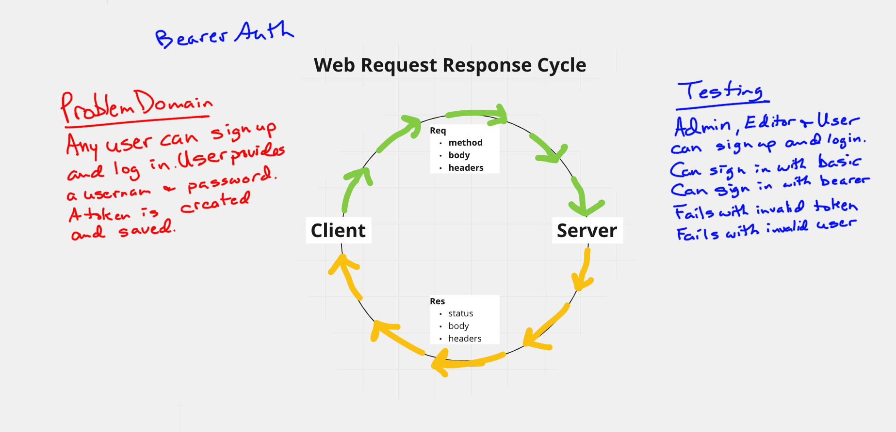

# Lab 7 bearer-auth

### Author: Dan Engel

### Links and Resources

- [ci/cd](https://github.com/daneng1/bearer-auth/actions/runs/791148819)
- [back-end server url](https://danengel-bearer-auth.herokuapp.com/)

### Setup

*Sign Up*

1. Go to [Swagger Inspector](https://inspector.swagger.io/builder)
1. Enter https://danengel-bearer-auth.herokuapp.com/signup as POST
1. In Body, enter { "username": "dan", "password": "dan"}
1. Click Send, this will create a new user. You should see the user object below.

*Sign In*

1. Enter https://danengel-bearer-auth.herokuapp.com/signin as POST
2. Click on Authentication and Headers and enter dan and dan for username and password
1. Click send and you will be logged in. You should see the user object including the token below.

#### `.env` requirements (when applicable)

- `PORT` - 3333

#### How to initialize/run your application (where applicable)

- npm run start

#### Tests

    admin users
      ✓ can create one (106 ms)
      ✓ can signin with basic (73 ms)
      ✓ can signin with bearer (80 ms)
    bad logins
      ✓ basic fails with known user and wrong password  (66 ms)
      ✓ basic fails with unknown user (3 ms)
      ✓ bearer fails with an invalid token (2 ms)
      ✓ basic fails with known user and wrong password  (60 ms)
      ✓ basic fails with unknown user (3 ms)
      ✓ bearer fails with an invalid token (2 ms)
      ✓ basic fails with known user and wrong password  (60 ms)
      ✓ basic fails with unknown user (2 ms)
      ✓ bearer fails with an invalid token (2 ms)
    editor users
      ✓ can create one (64 ms)
      ✓ can signin with basic (62 ms)
      ✓ can signin with bearer (67 ms)
    user users
      ✓ can create one (62 ms)
      ✓ can signin with basic (61 ms)
      ✓ can signin with bearer (67 ms)

#### UML / Application Wiring Diagram

